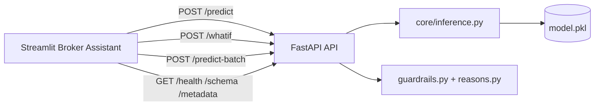

# Architecture

## Runtime sequence
1. API loads `model.pkl` once on startup.
2. `/predict` receives payload and validates with Pydantic.
3. Missing fields are filled from `DEFAULT_VALUES`.
4. Guardrails generate `warnings[]`.
5. Inference core preprocesses, reindexes by `feature_list`, and predicts probabilities.
6. API returns `bundle_id`, `top_k`, `latency_ms`, `warnings`, `reasons`, and confidence payload.
